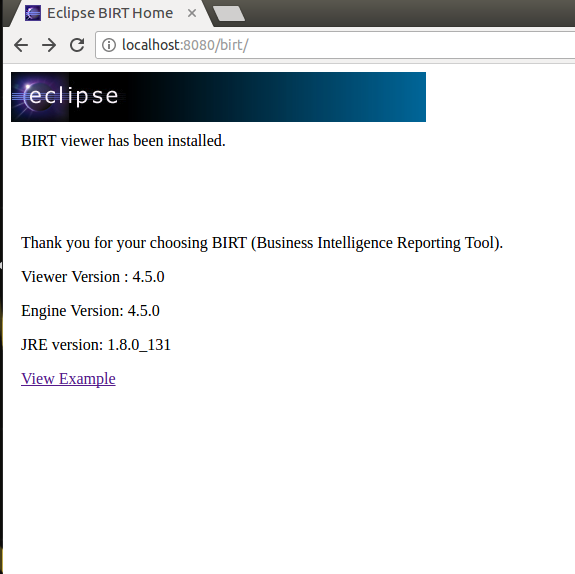
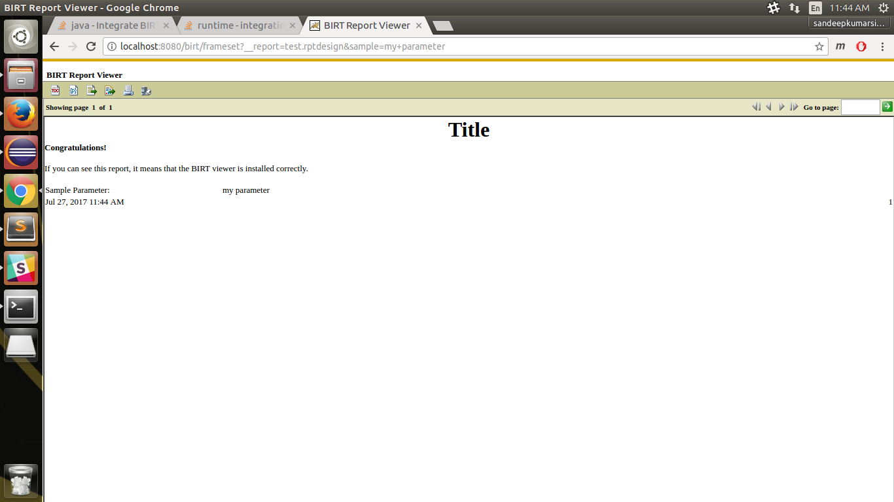

# BIRT integration with web services.

The Business Intelligence and Reporting Tools (BIRT) project is an open source, Eclipse-based reporting framework that enables the creation and deployment of complex report designs. 

 * Development with BIRT can usually be thought of as a two-step process:
 	* The creation of the report designs within the Eclipse BIRT Report Designer
	* Deployment of the designs and framework to an application for dissemination.

* BIRT offers three __public APIs__ and a __J2EE servlet-based viewer__ that can be used outside of Eclipse.
	* __Design Engine API (DE API)__ – The DE API is responsible for creating and modifying the XML report design format. This API is what the Eclipse BIRT Report Designer uses to create the report design.
	`The org.eclipse.birt.report.model.api` package hierarchy is by far the larger of the two BIRT APIs. 

		This API provides access to the content and structure of a BIRT design, a template, or a library. A BIRT based application can call this API to change the structure of a BIRT design. The Design Engine API is also used in the development of a custom BIRT designer.

	* __Report Engine API (RE API)__ – The RE API is responsible for consuming the report design files and producing the report output.

		`The org.eclipse.birt.report.engine.api` package hierarchy contains the API to access the report generation functions. This API provides the most commonly used functionality for a reporting application.

		 The key class in the Report Engine API is ReportEngine. This class provides access to all the tasks required to create the desired output file from a BIRT design (.rptdesign) or a BIRT document (.rptdocument). The Report Engine API also includes the classes and packages that support the scripting capabilities of a report design.

	* __Chart Engine API (CE API)__ – The org.eclipse.birt.chart package hierarchy contains the API that a developer of a custom chart generator uses. A BIRT based application can also use this API in conjunction with the Report Engine and Design Engine APIs to create and modify chart elements in a BIRT design.


## BIRT Deployment
Because the RE API is the main API responsible for generating the reports, we will focus on the available options for its development. Some of the most common deployment options are listed below:

* Deploy the __BIRT sample Viewer__ to a J2EE application server.
* Integrate the __BIRT sample viewer__ application in the existing web application
* Write your own servlet that wraps the RE API and deploy it to a J2EE application server.

### 1. Deploy the BIRT Viewer to a J2EE application server.

* [BIRT Sample Viewer](http://developer.actuate.com/deployment-center/deployment-guides/birt-engine-and-sample-viewer/) – The sample BIRT viewer (that comes in bundle with BIRT runtime download) is a web application, comprised of servlets and JSPs, that encapsulates the RE API to generate reports. In addition to generating reports, it supports HTML pagination, PDF, Table of Contents (TOC) functionality, and export to CSV.

	Once deployed, the reports (in .rptdesign and .rptdocument) are easily rendered and can be viewed on the server.
	Here are the steps to deploy the BIRT Viewer on tomcat :
	
	* Download BIRT Runtime from here. [http://download.eclipse.org/birt/downloads/](http://download.eclipse.org/birt/downloads/)
	* Extract your file to a location
	* Add $BIRT_RUNTIME to your environment:
		*  `sudo gedit ~/.bashrc`
		* add `export BIRT_RUNTIME=/path/to/birt/runtime/`
		* save it `source ~/.bashrc`
	* Copy the __WebViewerExample__ directory from your BIRT Runtime folder to tomcat's __webapps__ directory
	* Rename it to say `birt`
	* Put your .rptdesign report in `birt` folder. You can change the default working directory in `/WEB-INF/web.xml`
	* `Restart tomcat`. If the follwing screenshot is displayed, you have successfully deployed BIRT viewer on tomcat.
		
		
	* go to your browser at
		* `http://localhost:8080/birt/frameset?__report=test.rptdesign&sample=my+parameter`
		* Replace `test.rptdesign` with your file name in url.
		
		__Note__: Your report file must reside in `/tomcat/webapps/birt` directory	
	* Here is the sample test report already provided by birt.

		

For troubleshooting [click here]()

### 2. Integrate the __BIRT viewer__ application in the existing web application

Integrate the sample BIRT viewer application in the existing web application and maintain a single application instead, having the core features along with the responsibilities of rendering reports.

* Advantages: 
	* You can embed the runtime engine in the existing web application and use the RE for generating reports.
	* There is no need to copy the design report files to a separate war for rendering. It is a clean approach to integrate with your existing web application.
* Drawback:
	* Deploying BIRT in this fashion is that native functions supplied by the BIRT Viewer are not available without the developer coding them into the servlet. These functions include TOC, paginated HTML, and export to CSV.
	*  This approach is generally used when the developer has a specific need, such as direct generation to PDF, and does not want the other functions available in the viewer.

* Here are the steps:
	* Include all jars from the `WebViewerExample/WEB-INF/lib` directory of the birt runtime into your own `webapp/WEB-INF/lib` directory.

	* Add the following servlet mapping to your own `webapp/WEB-INF/web.xml` file:

		```
			<!-- Engine Servlet -->
			<servlet>
			    <servlet-name>EngineServlet</servlet-name>
			    <servlet-class>org.eclipse.birt.report.servlet.BirtEngineServlet</servlet-class>
			</servlet>

			<servlet-mapping>
			    <servlet-name>EngineServlet</servlet-name>
			    <url-pattern>/output</url-pattern>
			</servlet-mapping>
		```
	* You can then run .rptdesign files using the output BIRT report url from your own webapp, 
	* Specify whatever format you want, e.g.:	

		```
		http://localhost:8080/yourWebappName/output?__report=test.rptdesign&__format=pdf
		http://localhost:8080/yourWebappName/output?__report=test.rptdesign&__format=html
		http://localhost:8080/yourWebappName/output?__report=test.rptdesign&__format=xls
		http://localhost:8080/yourWebappName/output?__report=test.rptdesign&__format=doc
		http://localhost:8080/yourWebappName/output?__report=test.rptdesign&__format=ppt
		```

### 3. Write your own servlet that wraps the RE API and deploy it to a J2EE application server.

* Copy all the jars in the `birt-runtime/ReportEngine/lib` directory of the birt runtime into your `webapp/WEB-INF/lib` directory.

* If you are using Eclipse to build the servlet, make sure to add all the jars from the `birt-runtime/ReportEngine/lib` directory to your build path. 

* You will also need `servlet.jar` from the Tomcat Eclipse plugin in your build path.
	* click [here](http://www.java2s.com/Code/Jar/s/Downloadservletjar.htm) to download the servlet.

* We will create three files to execute our servlet 
	* BirtConfig.properties: Configuration properties for the Engine.
	* BirtFactory.java: Class used to initialize the Report Engine.
	* BirtServlet.java: The servlet that handles report generation on a GET command.

* BirtConfig.properties contain two entries.
	
	```
	logDirectory=/path/to/log/directory
	logLevel=FINEST
	```
	* The logDirectory specifies where the Report Engine will log entries. The logLevel sets the level for logging.
	* Ensure `BirtConfig.properties` is in your classpath.

* BirtFactory.java
	
```java

import java.io.IOException;
import java.io.InputStream;
import java.util.Properties;
import java.util.logging.Level;
import javax.servlet.ServletContext;
import org.eclipse.birt.core.exception.BirtException;
import org.eclipse.birt.core.framework.IPlatformContext;
import org.eclipse.birt.core.framework.Platform;
import org.eclipse.birt.core.framework.PlatformServletContext;
import org.eclipse.birt.report.engine.api.EngineConfig;
import org.eclipse.birt.report.engine.api.EngineConstants;
import org.eclipse.birt.report.engine.api.IReportEngine;
import org.eclipse.birt.report.engine.api.IReportEngineFactory;

public class BirtFactory {
	private static IReportEngine birtEngine = null;

	private static Properties configProps = new Properties();

	private final static String configFile = "BirtConfig.properties";

	public static synchronized void initBirtConfig() {
	 loadEngineProps();
	}

	public static synchronized IReportEngine getBirtEngine(ServletContext sc) {
	 if (birtEngine == null) 
	 {
	 /* start up Platform */
	  EngineConfig config = new EngineConfig();
	  if( configProps != null){
	   String logLevel = configProps.getProperty("logLevel");
	   Level level = Level.OFF;
	   if ("SEVERE".equalsIgnoreCase(logLevel)) 
	   {
	    level = Level.SEVERE;
	   } else if ("WARNING".equalsIgnoreCase(logLevel))
	   {
	    level = Level.WARNING;
	   } else if ("INFO".equalsIgnoreCase(logLevel)) 
	   {
	    level = Level.INFO;
	   } else if ("CONFIG".equalsIgnoreCase(logLevel))
	   {
	    level = Level.CONFIG;
	   } else if ("FINE".equalsIgnoreCase(logLevel)) 
	   {
	    level = Level.FINE;
	   } else if ("FINER".equalsIgnoreCase(logLevel)) 
	   {
	    level = Level.FINER;
	   } else if ("FINEST".equalsIgnoreCase(logLevel)) 
	   {
	    level = Level.FINEST;
	   } else if ("OFF".equalsIgnoreCase(logLevel)) 
	   {
	    level = Level.OFF;
	   }

	   config.setLogConfig(configProps.getProperty("logDirectory"), level);
	  }

	  config.getAppContext().put(EngineConstants.APPCONTEXT_CLASSLOADER_KEY, Thread.currentThread().getContextClassLoader()); 
	  
	  IPlatformContext context = new PlatformServletContext( sc );
	  config.setPlatformContext( context );


	  try
	  {
	   Platform.startup( config );
	  }
	  catch ( BirtException e )
	  {
	   e.printStackTrace( );
	  }

	  /* Create new Report Engine */
	  IReportEngineFactory factory = (IReportEngineFactory) Platform
	  .createFactoryObject( IReportEngineFactory.EXTENSION_REPORT_ENGINE_FACTORY );
	  birtEngine = factory.createReportEngine( config );


	 }
	 return birtEngine;
	}

	public static synchronized void destroyBirtEngine() {
	 if (birtEngine == null) {
	  return;
	 }  
	 birtEngine.shutdown();
	 Platform.shutdown();
	 birtEngine = null;
	}

	public Object clone() throws CloneNotSupportedException {
	 throw new CloneNotSupportedException();
	}

	private static void loadEngineProps() {
	 try {
	  //Config File must be in classpath
	  ClassLoader cl = Thread.currentThread ().getContextClassLoader();
	  InputStream in = null;
	  in = cl.getResourceAsStream (configFile);
	  configProps.load(in);
	  in.close();


	 } catch (IOException e) {
	  e.printStackTrace();
	 }

	}
}
```

* BirtServlet.java

```java
import java.io.IOException;

import java.io.PrintWriter;
import java.util.HashMap;
import java.util.logging.Level;
import java.util.logging.Logger;

import javax.servlet.ServletContext;
import javax.servlet.ServletException;
import javax.servlet.http.HttpServlet;
import javax.servlet.http.HttpServletRequest;
import javax.servlet.http.HttpServletResponse;

import org.eclipse.birt.report.engine.api.EngineConstants;
import org.eclipse.birt.report.engine.api.HTMLRenderContext;
import org.eclipse.birt.report.engine.api.HTMLRenderOption;
import org.eclipse.birt.report.engine.api.IReportEngine;
import org.eclipse.birt.report.engine.api.IReportRunnable;
import org.eclipse.birt.report.engine.api.IRunAndRenderTask;


public class BirtServlet extends HttpServlet {
	
	/**
	 * 
	 */
	private static final long serialVersionUID = 1L;
	/**
	 * Constructor of the object.
	 */
	private IReportEngine birtReportEngine = null;
	protected static Logger logger = Logger.getLogger( "org.eclipse.birt" );

	public BirtServlet() {
	 super();
	}

	/**
	 * Destruction of the servlet. 

	 */
	public void destroy() {
	 super.destroy(); 
	 BirtFactory.destroyBirtEngine();
	}


	/**
	 * The doGet method of the servlet. 

	 *
	 */
	public void doGet(HttpServletRequest req, HttpServletResponse resp)
	  throws ServletException, IOException {

	 //get report name and launch the engine
	 resp.setContentType("text/html");
	 //resp.setContentType( "application/pdf" ); 
	 //resp.setHeader ("Content-Disposition","inline; filename=test.pdf");  
	
	 String reportName = req.getParameter("ReportName");
	 ServletContext sc = req.getSession().getServletContext();
	 this.birtReportEngine = BirtFactory.getBirtEngine(sc);
	 
	 //setup image directory
	 HTMLRenderContext renderContext = new HTMLRenderContext();
	 renderContext.setBaseImageURL(req.getContextPath()+"/images");
	 renderContext.setImageDirectory(sc.getRealPath("/images"));
	 
	 logger.log( Level.FINE, "image directory " + sc.getRealPath("/images"));  
	 System.out.println("stdout image directory " + sc.getRealPath("/images"));
	 
	 <!-- here eclipse can suggest to change the compliance to java 1.5, do it -->
	 HashMap<String, HTMLRenderContext> contextMap = new HashMap<String, HTMLRenderContext>();
	 contextMap.put( EngineConstants.APPCONTEXT_HTML_RENDER_CONTEXT, renderContext );
	 
	 IReportRunnable design;
	 try
	 {
	  //Open report design
	  design = birtReportEngine.openReportDesign( sc.getRealPath("/Reports")+"/"+reportName );
	  //create task to run and render report
	  IRunAndRenderTask task = birtReportEngine.createRunAndRenderTask( design );  
	  task.setAppContext( contextMap );
	  
	  //set output options
	  HTMLRenderOption options = new HTMLRenderOption();
	  options.setOutputFormat(HTMLRenderOption.OUTPUT_FORMAT_HTML);
	  //options.setOutputFormat(HTMLRenderOption.OUTPUT_FORMAT_PDF);
	  options.setOutputStream(resp.getOutputStream());
	  task.setRenderOption(options);
	  
	  //run report
	  /* converting html output to string */
	  String output;
	  task.run();
	  output = resp.getOutputStream().toString();
	 
	  task.close();
	  
	  
	  
	 }catch (Exception e){
	  
	  e.printStackTrace();
	  throw new ServletException( e );
	 }
	}

	/**
	 * The doPost method of the servlet. 

	 *
	 */
	public void doPost(HttpServletRequest request, HttpServletResponse response)
	  throws ServletException, IOException {

	 response.setContentType("text/html");
	 PrintWriter out = response.getWriter();
	 out.println("<!DOCTYPE HTML PUBLIC \"-//W3C//DTD HTML 4.01 Transitional//EN\">");
	 out.println("<HTML>");
	 out.println("  <HEAD><TITLE>A Servlet</TITLE></HEAD>");
	 out.println("  <BODY>");
	 out.println(" Post does nothing");
	 out.println("  </BODY>");
	 out.println("</HTML>");
	 out.flush();
	 out.close();
	}

	/**
	 * Initialization of the servlet. 

	 *
	 * @throws ServletException if an error occure
	 */
	public void init() throws ServletException {
	 BirtFactory.initBirtConfig();
	 
	}

}
```

* Go to your `webapp/WEB-INF/web.xml` and add the servlet mapping as follows:
	```xml
	 <!-- Engine Servlet -->
		<servlet>
		    <servlet-name>EngineServlet</servlet-name>
		    <!-- full qualified name of BirtServlet Class -->
		    <servlet-class>packageName.BirtServlet</servlet-class>
		</servlet>
		
		<servlet-mapping>
		    <servlet-name>EngineServlet</servlet-name>
		    <url-pattern>/run</url-pattern>
		</servlet-mapping>
	```
* When deployed on tomcat, view your report at
	* `http://localhost:8080/yourWebappName/run?ReportName=test.rptdesign`
	* Ensure your reports reside in `webapp/Reports` directory. Create it if it does not exist.


## Troubleshooting
* `zip -d org.eclipse.birt.runtime_4.6.0-20160607.jar META-INF/ECLIPSE_.RSA`
* `zip -d org.eclipse.birt.runtime_4.6.0-20160607.jar META-INF/ECLIPSE_.SF`
* `zip -d org.eclipse.datatools.connectivity.oda_3.5.0.201603142002.jar META-INF/ECLIPSE_.RSA`
* `zip -d org.eclipse.datatools.connectivity.oda_3.5.0.201603142002.jar META-INF/ECLIPSE_.SF`


